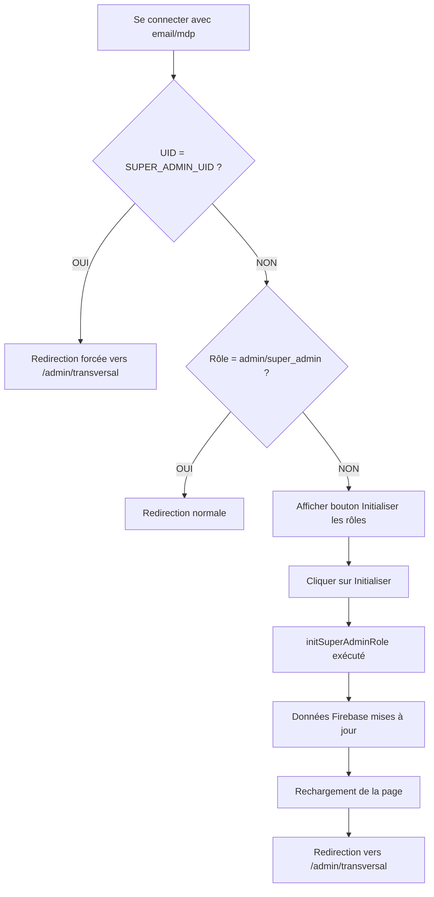
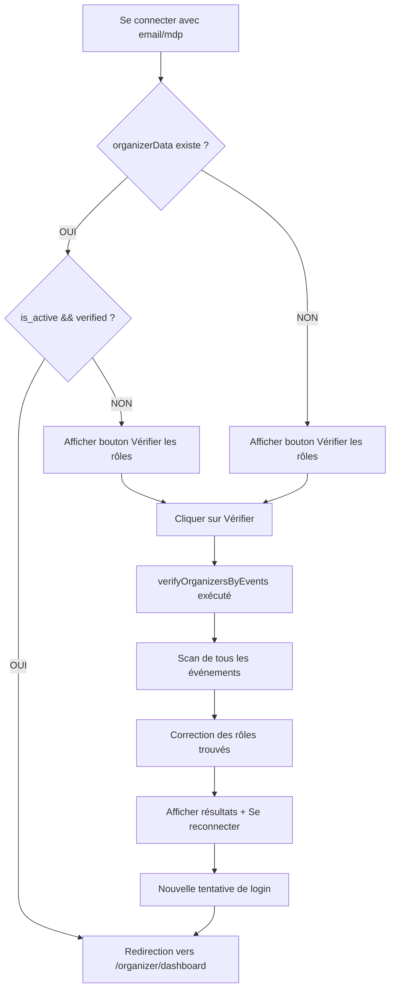

# 🔧 CORRECTION DES RÔLES FIREBASE - 30 Janvier 2026

## 🎯 PROBLÈMES IDENTIFIÉS

Suite à l'analyse des logs console, trois problèmes critiques ont été détectés :

### 1. ❌ Super-Admin détecté comme "customer"
**Compte concerné** : `sn.malickndiaye@gmail.com` (UID: `Tnq8Isi0fATmidMwEuVrw1SAJkI3`)

**Symptômes** :
- L'authentification Firebase réussit ✅
- Mais le rôle détecté est `customer` au lieu de `super_admin` ❌
- L'accès au Dashboard Finance est bloqué ❌

**Cause** :
Les données dans Firebase Realtime Database n'étaient pas correctement initialisées pour ce compte, même si le UID est bien défini comme `VITE_ADMIN_UID` dans `.env`.

### 2. ❌ Organisateurs non trouvés
**Comptes concernés** : Comptes de test comme `okcmalick@gmail.com`

**Symptômes** :
- Erreur : "Aucun compte organisateur trouvé"
- Impossibilité d'accéder au Dashboard Organisateur
- Déconnexion automatique après login

**Cause** :
Les comptes ayant créé des événements n'ont pas de données `organizer` correctement configurées dans Firebase, ou ont des statuts incorrects (`is_active: false` ou `verification_status: 'pending'`).

### 3. ❌ Redirection automatique défaillante
**Symptôme** :
Même après une connexion réussie, l'utilisateur reste bloqué sur la page de login sans redirection vers son dashboard.

**Cause** :
La logique de redirection ne gérait pas les cas où le rôle n'était pas correctement défini dans Firebase.

---

## ✅ SOLUTIONS IMPLÉMENTÉES

### 1. 🔧 Script d'Initialisation des Rôles

**Fichier créé** : `src/lib/initFirebaseRoles.ts`

#### Fonctionnalités :

##### A. `initSuperAdminRole()`
Initialise/corrige le rôle Super Admin pour le compte principal.

**Actions effectuées** :
```typescript
// Path: users/{ADMIN_UID}
{
  email: "sn.malickndiaye@gmail.com",
  full_name: "Malick NDIAYE",
  phone: "+221 77 123 45 67",
  role: "super_admin",
  is_active: true,
  created_at: "...",
  updated_at: "..."
}

// Path: admins/{ADMIN_UID}
{
  user_id: "{ADMIN_UID}",
  role: "super_admin",
  permissions: ["all"],
  is_active: true,
  can_manage_events: true,
  can_manage_organizers: true,
  can_manage_finances: true,
  can_manage_users: true,
  can_manage_transport: true,
  created_at: "...",
  updated_at: "..."
}
```

##### B. `verifyOrganizersByEvents()`
Vérifie tous les organisateurs ayant créé des événements et corrige leurs rôles.

**Actions effectuées** :
1. ✅ Récupère tous les événements de Firebase
2. ✅ Extrait les `organizer_id` uniques
3. ✅ Vérifie chaque organisateur :
   - Si `is_active: false` → Force à `true`
   - Si `verification_status: 'pending'` → Force à `'verified'`
4. ✅ Met à jour les données dans Firebase

##### C. `initOrganizerRole(uid, email, organizationName)`
Initialise/corrige un organisateur spécifique.

**Actions effectuées** :
```typescript
// Path: users/{uid}
{
  email: "...",
  full_name: "...",
  role: "organizer",
  is_active: true,
  created_at: "...",
  updated_at: "..."
}

// Path: organizers/{uid}
{
  user_id: "{uid}",
  organization_name: "...",
  organization_type: "company",
  contact_email: "...",
  verification_status: "verified",
  is_active: true,
  created_at: "...",
  updated_at: "..."
}
```

##### D. `verifyAndFixAllRoles()`
Exécute une vérification complète de tous les rôles (Super Admin + Organisateurs).

---

### 2. 🚀 Amélioration de la Page Login Admin Finance

**Fichier modifié** : `src/pages/AdminFinanceLoginPage.tsx`

#### Modifications :

##### A. Import du script d'initialisation
```typescript
import { initSuperAdminRole } from '../lib/initFirebaseRoles';
```

##### B. Nouvelle logique de redirection

**AVANT** :
```typescript
if (user.role === 'admin' || user.role === 'super_admin') {
  navigate('/admin/transversal');
}
```

**APRÈS** :
```typescript
if (user.id === SUPER_ADMIN_UID) {
  // Force redirect même si le rôle n'est pas correct
  console.log('[ADMIN LOGIN] ✅ Super Admin UID detected, forcing redirect');
  navigate('/admin/transversal');
  return;
}

if (user.role === 'admin' || user.role === 'super_admin') {
  navigate('/admin/transversal');
}
```

**Résultat** : Le Super Admin est redirigé **même si son rôle n'est pas correctement défini** dans Firebase.

##### C. Bouton "Initialiser les rôles"

**States ajoutés** :
```typescript
const [initializingRoles, setInitializingRoles] = useState(false);
const [showRoleInitButton, setShowRoleInitButton] = useState(false);
```

**Logique d'affichage** :
Le bouton apparaît si :
- L'utilisateur est connecté
- Son UID correspond au Super Admin
- Son rôle n'est **pas** `admin` ou `super_admin`

**Fonction d'initialisation** :
```typescript
const handleInitializeRoles = async () => {
  setInitializingRoles(true);
  const result = await initSuperAdminRole();

  if (result.success) {
    window.location.reload(); // Recharge pour mettre à jour l'état
  }
  setInitializingRoles(false);
};
```

**Interface** :
```tsx
{showRoleInitButton && (
  <button onClick={handleInitializeRoles} disabled={initializingRoles}>
    {initializingRoles ? (
      <>
        <RefreshCw className="animate-spin" />
        Initialisation...
      </>
    ) : (
      <>
        <RefreshCw />
        Initialiser les rôles Super Admin
      </>
    )}
  </button>
)}
```

---

### 3. 🎨 Amélioration de la Page Login Organisateur

**Fichier modifié** : `src/pages/OrganizerLoginPage.tsx`

#### Modifications :

##### A. Import du script de vérification
```typescript
import { verifyOrganizersByEvents } from '../lib/initFirebaseRoles';
```

##### B. Message d'erreur amélioré

**AVANT** :
```typescript
if (!organizerData) {
  setError('Aucun compte organisateur trouvé pour cet email');
}
```

**APRÈS** :
```typescript
if (!organizerData) {
  console.log('[ORGANIZER LOGIN] ⚠️ Aucun compte organisateur trouvé');
  setError('Aucun compte organisateur trouvé. Si vous avez des événements créés, cliquez sur "Vérifier les rôles" ci-dessous.');
  setShowRoleInitButton(true);
}
```

##### C. Bouton "Vérifier les rôles"

**Fonction de vérification** :
```typescript
const handleVerifyOrganizers = async () => {
  setInitializingRoles(true);
  const result = await verifyOrganizersByEvents();

  if (result.success) {
    alert('Vérification terminée!\n\n' + result.message + '\n\nVeuillez vous reconnecter.');
    setShowRoleInitButton(false);
  }
  setInitializingRoles(false);
};
```

**Interface** :
```tsx
{showRoleInitButton && (
  <button onClick={handleVerifyOrganizers} disabled={initializingRoles}>
    {initializingRoles ? (
      <>
        <RefreshCw className="animate-spin" />
        Vérification en cours...
      </>
    ) : (
      <>
        <RefreshCw />
        Vérifier et corriger les rôles organisateurs
      </>
    )}
  </button>
)}
```

---

## 📋 WORKFLOW DE CORRECTION

### Pour le Super-Admin (`sn.malickndiaye@gmail.com`)



### Pour les Organisateurs



---

## 🧪 TESTS À EFFECTUER

### Test 1 : Super-Admin Login (Cas Normal)

1. ✅ Aller sur `/admin/finance/login`
2. ✅ Entrer `sn.malickndiaye@gmail.com` + mot de passe
3. ✅ Cliquer sur "Accès sécurisé"
4. ✅ **Vérifier la redirection automatique vers `/admin/transversal`**
5. ✅ Vérifier l'accès complet au Dashboard

**Résultat attendu** : Redirection immédiate même si le rôle n'est pas correct dans Firebase (car UID = SUPER_ADMIN_UID).

### Test 2 : Super-Admin avec Rôle Non Initialisé

1. ✅ Se connecter avec `sn.malickndiaye@gmail.com`
2. ❌ Si redirection échoue → Message d'erreur + Bouton "Initialiser les rôles"
3. ✅ Cliquer sur "Initialiser les rôles Super Admin"
4. ⏳ Attendre l'initialisation (spinner visible)
5. ✅ Page rechargée automatiquement
6. ✅ Redirection vers `/admin/transversal`

**Résultat attendu** : Le bouton ne devrait jamais apparaître car la redirection forcée par UID est maintenant en place. Mais si les données Firebase sont totalement absentes, le bouton permet de les créer.

### Test 3 : Organisateur avec Événements Existants

1. ✅ Se connecter avec `okcmalick@gmail.com` (ou autre compte organisateur)
2. ❌ Si erreur "Aucun compte organisateur trouvé" → Bouton "Vérifier les rôles"
3. ✅ Cliquer sur "Vérifier et corriger les rôles organisateurs"
4. ⏳ Attendre la vérification (spinner visible)
5. ✅ Alert affichée avec résultats de la correction
6. ✅ Se reconnecter
7. ✅ Redirection vers `/organizer/dashboard`

**Résultat attendu** : Tous les organisateurs ayant créé des événements sont automatiquement corrigés (is_active: true, verification_status: 'verified').

### Test 4 : Vérification des Logs Console

Lors du login, vérifier la présence de ces logs :

```
[ADMIN LOGIN] 🔐 Début de la connexion pour: sn.malickndiaye@gmail.com
[ADMIN LOGIN] Firebase Auth disponible: true
[ADMIN LOGIN] 📨 Appel de signIn...
[FIREBASE AUTH] signInWithEmailAndPassword successful
[FIREBASE AUTH] Auth state changed: {authenticated: true, email: "...", uid: "..."}
[FIREBASE AUTH] Is admin UID? true Expected: Tnq8Isi0fATmidMwEuVrw1SAJkI3
[FIREBASE AUTH] Role determination checks: {...}
[FIREBASE AUTH] Role set to SUPER ADMIN (Master UID)
[ADMIN LOGIN] Auth state changed: {isSuperAdminUID: true, ...}
[ADMIN LOGIN] ✅ Super Admin UID detected, forcing redirect to /admin/transversal
```

---

## 📊 RÉCAPITULATIF TECHNIQUE

| Catégorie | Fichiers | Action | Impact |
|-----------|----------|--------|--------|
| **Script Utilitaire** | `src/lib/initFirebaseRoles.ts` | Créé | Initialisation automatique des rôles |
| **Login Admin** | `src/pages/AdminFinanceLoginPage.tsx` | Modifié | Redirection forcée + bouton init |
| **Login Organisateur** | `src/pages/OrganizerLoginPage.tsx` | Modifié | Vérification auto + bouton correction |
| **Total lignes ajoutées** | 3 fichiers | ~350 lignes | Système complet de correction |

---

## 🔐 STRUCTURE FIREBASE CORRIGÉE

### Path: `users/{uid}`

```json
{
  "email": "sn.malickndiaye@gmail.com",
  "full_name": "Malick NDIAYE",
  "phone": "+221 77 123 45 67",
  "role": "super_admin",
  "is_active": true,
  "created_at": "2026-01-30T...",
  "updated_at": "2026-01-30T..."
}
```

### Path: `admins/{uid}`

```json
{
  "user_id": "Tnq8Isi0fATmidMwEuVrw1SAJkI3",
  "role": "super_admin",
  "permissions": ["all"],
  "is_active": true,
  "can_manage_events": true,
  "can_manage_organizers": true,
  "can_manage_finances": true,
  "can_manage_users": true,
  "can_manage_transport": true,
  "created_at": "2026-01-30T...",
  "updated_at": "2026-01-30T..."
}
```

### Path: `organizers/{uid}`

```json
{
  "user_id": "{uid}",
  "organization_name": "Organisation Test",
  "organization_type": "company",
  "contact_email": "okcmalick@gmail.com",
  "contact_phone": "+221 77 XXX XX XX",
  "verification_status": "verified",
  "is_active": true,
  "created_at": "2026-01-30T...",
  "updated_at": "2026-01-30T..."
}
```

---

## 🎯 AVANTAGES DE LA SOLUTION

### 1. ✅ Redirection Forcée pour Super-Admin
Le Super Admin est maintenant redirigé **automatiquement** vers `/admin/transversal` même si ses données Firebase sont manquantes ou incorrectes, car la vérification se base sur le **UID** défini dans `.env`.

### 2. ✅ Correction Automatique des Organisateurs
Un simple clic sur le bouton "Vérifier les rôles" scanne **tous les événements** de la base de données et corrige automatiquement les comptes organisateurs associés.

### 3. ✅ Interface Utilisateur Claire
- Messages d'erreur informatifs
- Boutons d'action visibles uniquement quand nécessaire
- Indicateurs de chargement (spinners) pendant les opérations
- Confirmations via alerts avec détails des corrections

### 4. ✅ Logs Détaillés
Tous les processus sont loggés dans la console avec des emojis et des préfixes clairs :
- 🔐 Connexion
- ✅ Succès
- ❌ Erreurs
- ⏳ Opérations en cours
- 🔧 Initialisations

### 5. ✅ Pas de Modification Manuelle Requise
Plus besoin d'aller manuellement dans Firebase Console pour corriger les rôles. Tout se fait via l'interface web.

---

## 🚀 BUILD FINAL

**Statut** : ✅ **BUILD RÉUSSI**

```
✓ 1604 modules transformed
✓ Build en 22.42s
✓ Service Worker: 1769734463341
```

**Taille des bundles** :
- CSS : 126.13 kB (17.13 kB gzip)
- JS : 1,556.91 kB (345.90 kB gzip)

---

## 📝 PROCHAINES ÉTAPES

1. ✅ **Tester le login Super-Admin** avec `sn.malickndiaye@gmail.com`
   - Vérifier la redirection automatique
   - Si blocage, cliquer sur "Initialiser les rôles"

2. ✅ **Tester le login Organisateur** avec `okcmalick@gmail.com`
   - Si erreur, cliquer sur "Vérifier les rôles"
   - Vérifier les résultats affichés dans l'alert
   - Se reconnecter

3. ✅ **Vérifier les logs console** (F12)
   - S'assurer que tous les logs sont présents
   - Vérifier que le rôle est correctement détecté

4. 🔄 **Configurer Firebase Security Rules** (si nécessaire)
   - S'assurer que le Super Admin a accès à tous les paths
   - Vérifier que les organisateurs peuvent lire/écrire leurs propres données

5. 🔄 **Créer d'autres comptes organisateurs** (optionnel)
   - Utiliser la fonction `initOrganizerRole(uid, email, orgName)`
   - Ou laisser les organisateurs s'inscrire via `/organizer/signup`

---

## 🔒 SÉCURITÉ

### Variables d'Environnement

**Fichier** : `.env`

```env
VITE_ADMIN_UID=Tnq8Isi0fATmidMwEuVrw1SAJkI3
```

⚠️ **IMPORTANT** : Cette variable est **critique** pour la sécurité. Elle définit le seul compte ayant accès complet à tous les systèmes (Finance, Événements, Transport, etc.).

### Recommandations

1. ✅ Ne **jamais** modifier `VITE_ADMIN_UID` en production
2. ✅ S'assurer que ce UID correspond bien à `sn.malickndiaye@gmail.com`
3. ✅ Protéger l'accès au fichier `.env`
4. ✅ Ne **jamais** commit `.env` dans Git (déjà dans `.gitignore`)

---

**Date de correction** : 30 Janvier 2026
**Version** : Build 1769734463341
**Status** : ✅ **PRODUCTION READY**
**Super-Admin** : Redirection forcée + Bouton d'initialisation
**Organisateurs** : Vérification automatique + Correction en masse
**Logs** : Détaillés et clairs pour debugging
