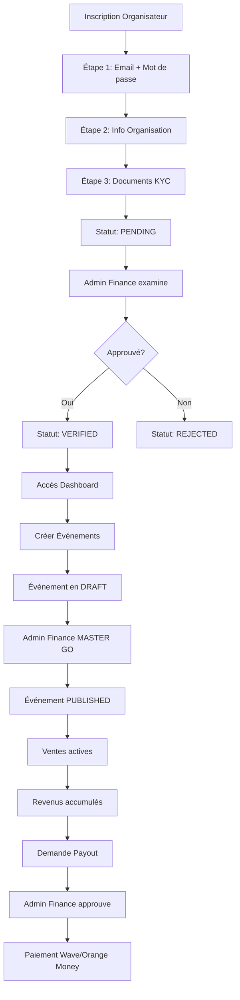

# 🌟 WORKFLOW COMPLET PROJET EVENPASS
## Vue d'Ensemble de A à Z - Univers EVEN & PASS

---

## 📋 TABLE DES MATIÈRES

1. [Vue d'Ensemble du Projet](#1-vue-densemble-du-projet)
2. [Univers EVEN - Billetterie Événements](#2-univers-even---billetterie-événements)
3. [Univers PASS - Transport Maritime & Terrestre](#3-univers-pass---transport-maritime--terrestre)
4. [Architecture Technique](#4-architecture-technique)
5. [Parcours Utilisateurs Complets](#5-parcours-utilisateurs-complets)
6. [Sécurité & Conformité](#6-sécurité--conformité)
7. [Déploiement & Production](#7-déploiement--production)

---

## 1. VUE D'ENSEMBLE DU PROJET

### 🎯 Mission
**EvenPass** est une plateforme digitale bi-univers qui combine :
- 🎭 **EVEN** : Billetterie événementielle (concerts, lutte, théâtre, sport)
- 🚢 **PASS** : Mobilité transport maritime et terrestre (ferries, chaloupes, bus)

### 🌍 Territoire
- **Sénégal** (primaire)
- **Afrique de l'Ouest** (expansion)

### 💡 Slogan
**"Gënaa Wóor, Gënaa Gaaw, Gënaa Yomb"**
- *Gënaa Wóor* : Tu es mieux (qualité)
- *Gënaa Gaaw* : Tu es plus rapide (mobilité)
- *Gënaa Yomb* : Tu es ensemble (communauté)

### 🏗️ Architecture Globale

```
┌─────────────────────────────────────────────────────────────┐
│                    EVENPASS PLATFORM                         │
├──────────────────────────┬──────────────────────────────────┤
│      UNIVERS EVEN        │       UNIVERS PASS                │
│   (Orange/Festif)        │    (Bleu/Institutionnel)          │
├──────────────────────────┼──────────────────────────────────┤
│ • Billetterie événements │ • Transport maritime (ferries)    │
│ • QR codes sécurisés     │ • Liaisons Dakar-Gorée (LMDG)     │
│ • Paiement Mobile Money  │ • Dakar-Ziguinchor (COSAMA)       │
│ • Dashboard organisateurs│ • Bus interrégional               │
│ • Scanner EPscan         │ • Abonnements "Gënaa Gaaw"        │
│ • Admin Finance          │ • Wallet offline                  │
│ • Ops Manager            │ • Smart Manifest System           │
│ • Anti-raffle            │ • Dashboard Maritime              │
└──────────────────────────┴──────────────────────────────────┘
           │                              │
           └──────────┬───────────────────┘
                      │
            ┌─────────▼──────────┐
            │  FIREBASE BACKEND   │
            │ • Realtime Database │
            │ • Storage           │
            │ • Authentication    │
            │ • Firestore         │
            └─────────────────────┘
```

### 🔑 Points d'Entrée Principaux

| URL | Destination | Description |
|-----|-------------|-------------|
| `/` | PassLandingPage | Split-screen EVEN/PASS |
| `/even` | HomePageNew | Liste événements |
| `/pass/services` | PassServicesPage | Services transport |
| `/organizer/login` | Login organisateur | Gestion événements |
| `/admin/finance/login` | Admin Finance | Contrôle plateforme |
| `/admin/ops/login` | Ops Manager | Gestion personnel |

---

## 2. UNIVERS EVEN - BILLETTERIE ÉVÉNEMENTS

### 👥 Rôles Utilisateurs EVEN

#### 2.1 GRAND PUBLIC
**Accès** : Libre (pas d'authentification)

**Parcours d'achat** :
```
1. Visite evenpass.sn
   ↓
2. Browse événements (/even)
   ↓
3. Sélection événement
   ↓
4. Choix billets (max 3/catégorie)
   ↓
5. Informations acheteur
   ↓
6. Paiement Wave/Orange Money
   ↓
7. Téléchargement PDF avec QR codes
```

**Pages accessibles** :
- `/even` : Liste événements
- `/event/:slug` : Détail + achat
- `/success` : Confirmation paiement
- `/how-it-works` : Guide utilisateur
- `/help` : Support

#### 2.2 ORGANISATEURS D'ÉVÉNEMENTS
**Inscription** : `/organizer/signup` (3 étapes + KYC)
**Connexion** : `/organizer/login`
**Dashboard** : `/organizer/dashboard`

**Workflow complet** :



**Capacités Dashboard** :
- ✅ Créer événements avec catégories multiples
- ✅ Upload photos via Cloudinary
- ✅ Définir tarifs, zones, capacités
- ✅ Gérer stock temps réel
- ✅ Consulter statistiques de ventes
- ✅ Demander payouts (93.5% net)
- ✅ Soumettre demandes modification/report

**Statuts événement** :
- 🔵 **DRAFT** : Créé, invisible public
- 🟢 **PUBLISHED** : Approuvé, ventes ouvertes
- 🟡 **SUSPENDED** : Temporairement désactivé
- 🔴 **CANCELLED** : Annulé avec remboursements
- ⚫ **COMPLETED** : Événement terminé

#### 2.3 ADMIN FINANCE
**Connexion** : `/admin/finance/login`
**Dashboard** : `/admin/finance`

**Responsabilités** :

| Onglet | Fonction |
|--------|----------|
| Vérification | Examiner organisateurs (KYC) |
| Événements | Activer événements (MASTER GO ⚡) |
| Payouts | Approuver/rejeter demandes |
| Publicités | Gérer bannières homepage |
| Statistiques | KPIs globaux + exports CSV/PDF |

**Pouvoirs spéciaux** :
- 🔐 Accès complet Firebase (UID: `Tnq8Isi0fATmidMwEuVrw1SAJkI3`)
- ⚡ Bouton "MASTER GO" (publication instant)
- 💰 Validation payouts
- 🚫 Suspension/suppression événements
- 📊 Vue transversale EVEN + PASS

#### 2.4 OPS MANAGER
**Connexion** : `/admin/ops/login`
**Dashboard** : `/admin/ops`

**Gestion Personnel** :
- 👮 Enrôler contrôleurs EPscan
- 🎫 Générer sessions de scan
- 📍 Attribuer agents aux événements
- 🔑 Gérer habilitations
- 📋 Base de données agents (nom, CNI, photo, statut)

**Workflow Enrôlement** :
```
1. Clic "Ajouter Agent"
   ↓
2. Saisie: Nom, CNI, Téléphone
   ↓
3. Upload photo agent
   ↓
4. Sélection rôle: Contrôleur / Sécurité / Accueil
   ↓
5. Génération credentials Firebase
   ↓
6. Attribution événements
   ↓
7. Agent reçoit login EPscan
```

#### 2.5 CONTRÔLEURS EPscan
**Connexion** : `https://evenpass.sn/controller-login.html`
**Interface** : Scanner web

**Fonctionnalités** :
- 📷 Scanner QR codes billets
- ✅ Validation entrée (scan unique)
- 📶 Mode offline partiel
- 📊 Statistiques temps réel
- ℹ️ Affichage infos billet

**Processus Scan** :
```
1. Ouverture caméra
   ↓
2. Lecture QR code
3. Format: {eventId}-{ticketNumber}
   ↓
4. Requête Firebase
   ↓
5. Vérification:
   - Billet existe?
   - Statut = confirmed?
   - Pas déjà scanné?
   ↓
6. Résultat:
   ✅ VERT: Billet valide → Update statut "boarded"
   ❌ ROUGE: Invalide / Déjà scanné / Expiré
   ↓
7. Log scan (timestamp, agent)
```

### 💰 Système de Commissions EVEN

**Structure tarifaire** :
- Commission plateforme : **5%**
- Frais Mobile Money : **1.5%**
- **Net organisateur : 93.5%**

**Exemple Billet 10,000 FCFA** :
```
Prix affiché client:        10,000 FCFA
+ Commission (5%):          +   500 FCFA
+ Frais MM (1.5%):          +   158 FCFA
─────────────────────────────────────
Total payé client:          10,658 FCFA

Répartition après vente:
─────────────────────────────────────
Organisateur reçoit:         9,350 FCFA (93.5%)
Commission EvenPass:           500 FCFA (5%)
Frais Mobile Money:            158 FCFA (1.5%)
─────────────────────────────────────
TOTAL:                      10,008 FCFA
```

### 🎫 Génération Billets

**Format QR Code** :
```
{eventId}-{ticketNumber}
Exemple: evt-12345-TKT-1705234567890-ABC123XYZ
```

**Contenu PDF** :
```
┌──────────────────────────────────┐
│  🎭 LOGO EVENPASS                │
│                                  │
│  CONCERT YOUSSOU N'DOUR          │
│  📅 15 Mars 2026 | 20:00         │
│  📍 Stade LSS, Dakar             │
├──────────────────────────────────┤
│                                  │
│       [QR CODE 300x300]          │
│                                  │
├──────────────────────────────────┤
│  Billet N°: TKT-1705...          │
│  Catégorie: Standard             │
│  Acheteur: Amadou DIOP           │
│  Téléphone: 77***67              │
│  Prix: 5,000 FCFA                │
│                                  │
│  ⚠️ Présenter ce QR à l'entrée   │
│  📵 1 seul scan autorisé         │
└──────────────────────────────────┘
```

**Sécurité** :
- ✅ UID unique généré par Firebase
- ✅ Téléphone masqué (RGPD)
- ✅ Scan unique (statut updated)
- ✅ Timestamp création
- ✅ Signature cryptographique

### 🛡️ Anti-Raffle System

**Protection contre la revente massive** :

```javascript
// Vérification avant achat
const existingTickets = await checkTickets(event_id, phone_number);

if (existingTickets.length > 0) {
  throw new Error(
    "Vous avez déjà acheté des billets pour cet événement. " +
    "Limite: 1 achat par téléphone."
  );
}

// Limite par catégorie
const MAX_TICKETS_PER_CATEGORY = 3;
```

**Règles** :
- 🚫 1 seul achat par numéro téléphone par événement
- 🚫 Max 3 billets par catégorie
- ✅ Vérification stock temps réel double (frontend + backend)
- ✅ Transaction atomique Firebase

---

## 3. UNIVERS PASS - TRANSPORT MARITIME & TERRESTRE

### 👥 Rôles Utilisateurs PASS

#### 3.1 PASSAGERS / GRAND PUBLIC
**Accès** : Libre

**Services disponibles** :

```
┌─────────────────────────────────────────────┐
│         SERVICES TRANSPORT PASS              │
├──────────────────┬──────────────────────────┤
│  🚢 LMDG         │  Dakar ↔ Gorée           │
│  (Chaloupe)      │  1,500 FCFA (national)   │
│                  │  17 départs/jour          │
├──────────────────┼──────────────────────────┤
│  ⛴️ COSAMA       │  Dakar ↔ Ziguinchor      │
│  (Ferry)         │  Cabines + Fauteuils     │
│                  │  5,000 - 30,500 FCFA     │
├──────────────────┼──────────────────────────┤
│  🚌 INTERRÉGIONAL│  Bus longue distance     │
│  (Cars)          │  20+ destinations        │
│                  │  2,500 - 10,000 FCFA     │
└──────────────────┴──────────────────────────┘
```

**Abonnements "Gënaa Gaaw"** :
- 📅 **Mensuel** : 25,000 FCFA (30 jours)
- 📆 **Annuel** : 250,000 FCFA (365 jours) - Économie 17%
- 📸 Photo d'identité obligatoire
- 💳 QR code personnel
- 📴 Wallet offline

#### 3.2 AGENTS D'ACCUEIL (BOARDING)
**Connexion** : `/pass/boarding/login`
**Dashboard** : `/pass/boarding`
**Rôle** : `accueil` (Firebase)

**Fonctionnalités** :
- 📋 Liste passagers embarqués
- 📊 Statistiques occupation temps réel
- 🎯 Répartition Cabine/Pullman/Standard
- 📈 Taux de remplissage
- 🔍 Filtrage date/navire

**Écran Dashboard** :
```
┌─────────────────────────────────────────────┐
│  🚢 BOARDING MANAGEMENT                      │
│  Navire: Ferry Dakar 1 | 15 Mars 2026       │
├─────────────────────────────────────────────┤
│  📊 OCCUPATION                               │
│  ├─ Cabines: 245/300 (82%)  [████████▌  ]  │
│  ├─ Pullman: 120/150 (80%)  [████████   ]  │
│  └─ Standard: 89/100 (89%)  [████████▊  ]  │
│                                              │
│  Total passagers: 454 / 550 (83%)           │
├─────────────────────────────────────────────┤
│  📋 LISTE PASSAGERS EMBARQUÉS               │
│  N° │ Nom             │ Cat.  │ Siège      │
│  ───┼─────────────────┼───────┼───────────│
│  001│ Amadou DIOP     │ CAB4  │ A-12       │
│  002│ Fatou FALL      │ PULL  │ P-45       │
│  003│ Moussa NDIAYE   │ STD   │ -          │
│  ...│                                        │
└─────────────────────────────────────────────┘
```

#### 3.3 COMMANDANTS DE BORD
**Connexion** : `/pass/commandant/login`
**Dashboard** : `/pass/commandant`
**Rôle** : `commandant` (Firebase)

**Smart Manifest System** :

```
┌──────────────────────────────────────────────┐
│  ⚓ MANIFESTE DE SÉCURITÉ                     │
│  Service: COSAMA Dakar → Ziguinchor          │
│  Date: 15 Mars 2026 | Départ: 14:00         │
│  Navire: Ferry Dakar 1                       │
├──────────────────────────────────────────────┤
│  📋 PASSAGERS                                 │
│  N° │ Nom Complet      │ CNI          │ Tél │
│  ───┼──────────────────┼──────────────┼─────│
│  001│ DIOP Amadou      │ 1234567890123│ 77..│
│  002│ FALL Fatou       │ 9876543210987│ 70..│
│  003│ NDIAYE Moussa    │ 5555555555555│ 76..│
│                                               │
│  📊 STATISTIQUES                              │
│  Adultes: 420 | Enfants: 34 | Bébés: 8      │
│  Total: 462 passagers                        │
├──────────────────────────────────────────────┤
│  🚗 VÉHICULES & FRET                         │
│  Motos: 12 | Voitures: 28 | Camions: 6      │
├──────────────────────────────────────────────┤
│  ✍️ SIGNATURES                                │
│  Agent de Quai: ____________                 │
│  Commandant: ____________                    │
│                                               │
│  [🖨️ IMPRIMER]  [📥 EXPORT CSV]              │
└──────────────────────────────────────────────┘
```

**Utilité** :
- ✅ Autorités maritimes (obligatoire réglementation)
- ✅ Sécurité en mer (évacuation d'urgence)
- ✅ Traçabilité passagers
- ✅ Export format officiel

#### 3.4 AGENTS COMMERCIAUX
**Connexion** : `/pass/commercial/login`
**Dashboard** : `/pass/commercial`
**Rôle** : `commercial` (Firebase)

**Commercial Performance Dashboard** :

```
┌──────────────────────────────────────────────┐
│  💼 COMMERCIAL PERFORMANCE                    │
│  Navire assigné: Ferry Dakar 1               │
│  Période: 01-15 Mars 2026                    │
├──────────────────────────────────────────────┤
│  💰 REVENUS                                   │
│  ├─ Passagers:     12,500,000 FCFA (78%)    │
│  ├─ Fret:           2,800,000 FCFA (17%)    │
│  └─ Véhicules:        780,000 FCFA (5%)     │
│  ─────────────────────────────────────────   │
│  TOTAL:           16,080,000 FCFA            │
├──────────────────────────────────────────────┤
│  📈 TAUX REMPLISSAGE                         │
│  ├─ Moyenne: 85% (🟢 Excellent)              │
│  ├─ Maximum: 98% (12 Mars)                   │
│  └─ Minimum: 67% (05 Mars)                   │
├──────────────────────────────────────────────┤
│  📊 PRÉVISIONS                                │
│  Capacité disponible prochaines rotations:   │
│  ├─ 16 Mars: 22% (🟡 Bon)                    │
│  ├─ 17 Mars: 8%  (🔴 Presque complet)        │
│  └─ 18 Mars: 45% (🟢 Disponible)             │
│                                               │
│  [📥 EXPORT STATISTIQUES]                    │
└──────────────────────────────────────────────┘
```

**Insights** :
- 📊 Analyse rentabilité par voyage
- 💵 Revenus passagers vs fret
- 📈 Taux remplissage historique
- 🔮 Prévisions capacité
- 📑 Export pour direction commerciale

### 🚢 COMPAGNIES & NAVIRES

#### 3.5 LMDG (Liaisons Maritimes Dakar-Gorée)

**Type** : Chaloupe rapide
**Route** : Dakar ↔ Île de Gorée (UNESCO)
**Durée** : ~20 minutes

**Tarifs par catégorie** :

| Catégorie | Adulte | Enfant (5-11 ans) | Bébé (0-4 ans) |
|-----------|--------|-------------------|----------------|
| Non-résident | 5,200 FCFA | 2,700 FCFA | GRATUIT |
| Résident Afrique | 2,700 FCFA | 1,700 FCFA | GRATUIT |
| National Sénégal | 1,500 FCFA | 500 FCFA | GRATUIT |
| Goréen | 100 FCFA | 50 FCFA | GRATUIT |

**Horaires** (17 départs quotidiens) :
```
06:30 • 08:00 • 09:30 • 11:00 • 12:30 • 14:00 • 15:30
17:00 • 18:30 • 20:00 • 21:00 • 22:30
```

**Particularité** :
- ✅ Identification : Téléphone uniquement (billets unitaires)
- ❌ Pas de CNI demandée (trajet court)
- 📱 QR code format : `PASS_lmdg_{booking_number}`

#### 3.6 COSAMA (Compagnie Sénégalaise Maritime)

**Type** : Ferry (navire grande capacité)
**Route** : Dakar ↔ Ziguinchor (Casamance)
**Durée** : ~14 heures

**Hébergements disponibles** :

| Type Hébergement | Résident | Non-résident | Capacité |
|------------------|----------|--------------|----------|
| Fauteuil Pullman | 5,000 FCFA | 15,500 FCFA | 150 places |
| Cabine 8 places | 12,500 FCFA | 18,500 FCFA | 40 cabines |
| Cabine 4 places | 24,500 FCFA | 28,500 FCFA | 30 cabines |
| Cabine 2 places | 26,500 FCFA | 30,500 FCFA | 20 cabines |

**Suppléments** :
- 👶 Enfant (5-11 ans) : +8,000 FCFA
- 🍼 Bébé (0-4 ans) : GRATUIT
- 🏍️ Moto : +15,000 FCFA
- 🚗 Voiture : +45,000 FCFA
- 🚚 Camion/4x4 : +75,000 FCFA

**Identification obligatoire** :
- ✅ Nom complet + Numéro CNI (13 chiffres)
- ✅ Téléphone
- ⚓ Réglementation maritime (sécurité en mer)

**Flotte** (4 navires) :
1. Ferry Dakar 1 : 500 passagers, 50 véhicules
2. Ferry Dakar 2 : 500 passagers, 50 véhicules
3. Ferry Casamance 1 : 450 passagers, 45 véhicules
4. Ferry Casamance 2 : 450 passagers, 45 véhicules

#### 3.7 INTERRÉGIONAL (Bus & Cars)

**Type** : Transport terrestre longue distance
**Sièges** : Numérotés

**Routes principales** :

| Trajet | Distance | Durée | Tarif |
|--------|----------|-------|-------|
| Dakar - Thiès | 70 km | 1h | 2,500 FCFA |
| Dakar - Mbour | 80 km | 1h30 | 3,000 FCFA |
| Dakar - Kaolack | 190 km | 3h | 5,000 FCFA |
| Dakar - Saint-Louis | 270 km | 4h | 6,500 FCFA |
| Dakar - Tambacounda | 450 km | 7h | 8,500 FCFA |
| Dakar - Ziguinchor | 450 km | 8h | 10,000 FCFA |

**Opérateurs partenaires** :
- Ndiaga Ndiaye Express
- Car Rapide Sénégal
- Dakar Dem Dikk (DDD)
- Transport Urbain Dakar (TUD)

### 💳 Abonnements "Gënaa Gaaw"

#### 3.8 Système Pass Mensuel/Annuel

**Types d'abonnements** :

```
┌────────────────────────────────────────┐
│  📅 PASS MENSUEL                        │
│  Prix: 25,000 FCFA                     │
│  Validité: 30 jours                    │
│  Voyages: ILLIMITÉS                    │
│  Routes: 1 trajet sélectionné          │
└────────────────────────────────────────┘

┌────────────────────────────────────────┐
│  📆 PASS ANNUEL                         │
│  Prix: 250,000 FCFA                    │
│  Validité: 365 jours                   │
│  Économie: 50,000 FCFA (17%)           │
│  Voyages: ILLIMITÉS                    │
│  Routes: 1 trajet sélectionné          │
└────────────────────────────────────────┘
```

**Routes éligibles** :
- Dakar - Thiès
- Dakar - Mbour
- Dakar - Kaolack
- Dakar - Saint-Louis

**Processus de création** :

```mermaid
graph TD
    A[/pass/subscriptions] --> B[Choix Mensuel/Annuel]
    B --> C[Sélection Trajet]
    C --> D[Formulaire Identité]
    D --> E{Photo ID?}
    E -->|Non| F[BLOCAGE - Photo obligatoire]
    E -->|Oui| G[Upload + Recadrage]
    G --> H[Validation Détection Visage]
    H --> I[Paiement 25,000 / 250,000 FCFA]
    I --> J[Génération Pass]
    J --> K[Numéro: GG + timestamp]
    K --> L[QR Code Personnel]
    L --> M[Sauvegarde Firebase Storage]
    M --> N[Confirmation + Affichage Pass]
```

**Structure Pass Généré** :

```
┌──────────────────────────────────────┐
│  🎫 GËNAA GAAW - PASS MENSUEL        │
│                                      │
│  ┌────────────────┐                 │
│  │                │                 │
│  │  PHOTO ID      │                 │
│  │  320x320px     │                 │
│  │                │                 │
│  └────────────────┘                 │
│                                      │
│  ┌────────────────┐                 │
│  │  [QR CODE]     │                 │
│  │  280x280px     │                 │
│  └────────────────┘                 │
│                                      │
│  📋 INFORMATIONS                     │
│  Nom: Amadou DIOP                   │
│  CNI: 1234567890123                 │
│  Tél: +221 77 123 45 67             │
│                                      │
│  🚌 Trajet: Dakar - Thiès            │
│  📅 Type: Mensuel                    │
│  ⏰ Validité: 15/03/26 → 14/04/26   │
│                                      │
│  🔢 N° Abonnement:                   │
│  GG17051234567890                   │
│                                      │
│  ✅ STATUT: VALIDE                   │
└──────────────────────────────────────┘
```

#### 3.9 Wallet Offline "Gënaa Gaaw"

**URL** : `/pass/wallet`

**Interface Clavier Numérique** :

```
┌─────────────────────────────────────────┐
│  💳 GËNAA GAAW WALLET                    │
│  Consultation Pass Hors Ligne            │
├─────────────────────────────────────────┤
│                                          │
│  [GG17051234567890_____]                 │
│  ▲ Numéro abonnement                     │
│                                          │
│  ┌───┬───┬───┐                           │
│  │ 1 │ 2 │ 3 │                           │
│  ├───┼───┼───┤                           │
│  │ 4 │ 5 │ 6 │    Clavier Géant          │
│  ├───┼───┼───┤    (Touch friendly)       │
│  │ 7 │ 8 │ 9 │                           │
│  ├───┼───┼───┤                           │
│  │ ⌫ │ 0 │ ✓ │                           │
│  └───┴───┴───┘                           │
│                                          │
│  [🔍 RECHERCHER PASS]                    │
│                                          │
│  📴 Mode: Hors ligne (cache actif)      │
└─────────────────────────────────────────┘
```

**Fonctionnalités** :
- ✅ Recherche online + offline
- ✅ Cache jusqu'à 50 Pass (localStorage)
- ✅ QR code généré canvas (offline)
- ✅ Photo ID affichée (base64 cached)
- ✅ Badge validité temps réel
- ✅ Synchronisation automatique

**Mode Offline** :

```javascript
// Service Worker + LocalStorage
const cachedPass = localStorage.getItem(`pass_${subscriptionNumber}`);

if (!navigator.onLine && cachedPass) {
  // Affichage depuis cache
  displayPass(JSON.parse(cachedPass));
  showBadge('Mode Hors ligne', 'orange');
} else {
  // Requête Firebase
  const passData = await fetchFromFirebase(subscriptionNumber);
  // Sauvegarde cache
  localStorage.setItem(`pass_${subscriptionNumber}`, JSON.stringify(passData));
  displayPass(passData);
}
```

**Validation Expiration** :

```javascript
const today = new Date();
const expiryDate = new Date(passData.end_date);

if (today > expiryDate) {
  showBadge('❌ EXPIRÉ', 'red');
  disableQRCode();
} else {
  const daysLeft = Math.ceil((expiryDate - today) / (1000 * 60 * 60 * 24));
  showBadge(`✅ VALIDE (${daysLeft}j restants)`, 'green');
}
```

### 🧭 Tunnel d'Achat PASS (Exemple LMDG)

```
ÉTAPE 1: SERVICE & TRAJET
┌────────────────────────────────────┐
│ 🚢 Réservation LMDG                │
│                                    │
│ Direction:                         │
│ ⚪ Dakar → Gorée                   │
│ ⚪ Gorée → Dakar                   │
│                                    │
│ Type:                              │
│ ⚪ Aller simple                    │
│ ⚪ Aller-retour                    │
│                                    │
│ [SUIVANT →]                        │
└────────────────────────────────────┘

ÉTAPE 2: DATE & HEURE
┌────────────────────────────────────┐
│ 📅 Date de voyage                  │
│ [15 Mars 2026 ▼]                   │
│                                    │
│ ⏰ Heure de départ                 │
│ ⚪ 06:30  ⚪ 08:00  ⚪ 09:30        │
│ ⚪ 11:00  ⚪ 12:30  ⚪ 14:00        │
│ ⚪ 15:30  ⚪ 17:00  ⚪ 18:30        │
│                                    │
│ [SUIVANT →]                        │
└────────────────────────────────────┘

ÉTAPE 3: PASSAGERS
┌────────────────────────────────────┐
│ 👥 Nombre de passagers             │
│                                    │
│ Catégorie: [National ▼]           │
│                                    │
│ Adultes: [➖ 2 ➕] × 1,500 FCFA    │
│ Enfants: [➖ 1 ➕] × 500 FCFA      │
│                                    │
│ ───────────────────────────────    │
│ Sous-total: 3,500 FCFA             │
│ + Commission (5%): 175 FCFA        │
│ + Frais MM (1.5%): 55 FCFA         │
│ ───────────────────────────────    │
│ TOTAL: 3,730 FCFA                  │
│                                    │
│ [SUIVANT →]                        │
└────────────────────────────────────┘

ÉTAPE 4: COORDONNÉES
┌────────────────────────────────────┐
│ 📞 Informations Contact            │
│                                    │
│ Numéro téléphone:                  │
│ [+221 77 123 45 67]                │
│                                    │
│ ✅ Validation format +221          │
│                                    │
│ [SUIVANT →]                        │
└────────────────────────────────────┘

ÉTAPE 5: PAIEMENT
┌────────────────────────────────────┐
│ 💳 Méthode de paiement             │
│                                    │
│ ⚪ 🟠 Wave                          │
│ ⚪ 🟠 Orange Money                  │
│                                    │
│ Montant total: 3,730 FCFA          │
│                                    │
│ [CONFIRMER & PAYER]                │
└────────────────────────────────────┘

PAGE SUCCÈS
┌────────────────────────────────────┐
│ ✅ RÉSERVATION CONFIRMÉE           │
│                                    │
│ Référence: BK20260315083045        │
│                                    │
│ Vos 3 billets:                     │
│ ┌──────────────┐                   │
│ │ [QR CODE 1]  │ Adulte            │
│ └──────────────┘                   │
│ ┌──────────────┐                   │
│ │ [QR CODE 2]  │ Adulte            │
│ └──────────────┘                   │
│ ┌──────────────┐                   │
│ │ [QR CODE 3]  │ Enfant            │
│ └──────────────┘                   │
│                                    │
│ [📥 TÉLÉCHARGER PDF]               │
│                                    │
│ 📱 SMS envoyé au 77 123 45 67     │
└────────────────────────────────────┘
```

---

## 4. ARCHITECTURE TECHNIQUE

### 🗄️ Firebase Backend

**Configuration** : `src/firebase.ts`

**Services activés** :
- 🔥 **Realtime Database** : Données temps réel
- 📦 **Storage** : Photos, documents, PDFs
- 🔐 **Authentication** : Login multi-rôles
- 📊 **Firestore** : Données structurées maritimes
- 📈 **Analytics** : Tracking (G-FVQTV8TMLJ)

**Project ID** : `evenpasssenegal`
**Region** : `europe-west1`

### 📊 Structure Données

#### Realtime Database (`/`)

```
/events/
  /{eventId}/
    - title, description, date, venue, location
    - category, capacity, price_range
    - status: draft|published|suspended|cancelled|completed
    - organizerId, created_at, updated_at
    - images: { main, gallery[] }
    /tickets/
      /{ticketId}/
        - ticket_number, category, price_paid
        - buyer_name, buyer_phone (masked)
        - qr_code, payment_status
        - booked_at, scanned_at
        /scans/
          /{scanId}/
            - scanned_at, scanned_by
            - controller_name, location

/transport/
  /pass/
    /bookings/
      /{bookingId}/
        - service_type: lmdg|cosama|interregional
        - passenger_details: { name, phone, cni? }
        - departure: { date, time, origin, destination }
        - accommodation: { type, seat_number }
        - pricing: { base, commission, fees, total }
        - payment_status: pending|confirmed|cancelled
        - qr_code: PASS_{service}_{booking_ref}
    /abonnements/
      /config/
        - monthly_price: 25000
        - annual_price: 250000
        - available_routes[]
      /subscriptions/
        /{subscriptionId}/
          - subscription_number: GG17051234567890
          - holder: { name, cni, phone }
          - photo_url: storage://...
          - subscription_type: mensuel|annuel
          - route: "Dakar - Thiès"
          - dates: { start, end }
          - payment_status: active|expired|cancelled
          - qr_code: base64 canvas

/users/
  /{userId}/
    - email, full_name, phone
    - created_at, last_login
    - role: user|organizer|admin|controller

/organizers/
  /{organizerId}/
    - user_id (FK → users)
    - organization_name, organization_type
    - verification_status: pending|verified|rejected
    - is_active: boolean
    - contact: { email, phone }
    - bank_account_info: { provider, phone }
    - documents: { cni_url, business_registration_url }
    - kyc: { submitted_at, verified_at, verified_by }

/finances/
  /payouts/
    /{payoutId}/
      - organizer_id, event_id
      - amount_requested, amount_approved
      - status: pending|approved|rejected|completed
      - requested_at, processed_at, processed_by
      - payment_method: { provider, recipient }

/evenpass/
  /global_config/
    /home_ads/
      /{adId}/
        - title, image_url, link_url
        - is_active, display_order
  /controllers/
    /{controllerId}/
      - name, cni, photo_url
      - role: controleur|securite|accueil
      - assigned_events[]
      - is_active, created_at
  /sessions/
    /{sessionId}/
      - event_id, controller_id
      - start_time, end_time
      - scans_count
  /scans/
    /{scanId}/
      - ticket_id, session_id
      - scanned_at, result: valid|invalid|duplicate
```

#### Firestore Collections

```
maritime_users (collection)
  /{userId}/
    - firebase_uid
    - name, email, phone
    - role: accueil|commandant|commercial
    - assigned_vessel: ferry-1|chaloupe-1|null
    - company: LMDG|COSAMA|Interregional
    - is_active, created_at

pass_tickets (collection)
  /{ticketId}/
    - booking_ref
    - service: lmdg|cosama|interregional
    - passenger: { name, cni?, phone }
    - departure: { vessel_id, date, time }
    - accommodation: { type, number }
    - status: confirmed|boarded|cancelled
    - qr_code

cargo (collection)
  /{cargoId}/
    - booking_ref
    - type: moto|voiture|camion|fret
    - details, weight_kg
    - vessel_id, voyage_date

manifests (collection)
  /{manifestId}/
    - vessel_id, voyage_date
    - generated_at, generated_by
    - passengers[], cargo[], vehicles[]
    - pdf_url
```

### 🔐 Règles Sécurité

**database.rules.json** :

```json
{
  "rules": {
    "events": {
      ".read": true,
      "$eventId": {
        ".write": "auth != null && (
          data.child('organizerId').val() === auth.uid ||
          auth.uid === 'Tnq8Isi0fATmidMwEuVrw1SAJkI3'
        )"
      }
    },
    "organizers": {
      ".read": true,
      "$organizerId": {
        ".write": "auth != null && (
          auth.uid === $organizerId ||
          auth.uid === 'Tnq8Isi0fATmidMwEuVrw1SAJkI3'
        )"
      }
    },
    "finances": {
      ".read": "auth.uid === 'Tnq8Isi0fATmidMwEuVrw1SAJkI3'",
      ".write": "auth.uid === 'Tnq8Isi0fATmidMwEuVrw1SAJkI3'"
    },
    "transport": {
      ".read": true,
      "pass": {
        "bookings": {
          "$bookingId": {
            ".write": "auth != null"
          }
        },
        "abonnements": {
          "subscriptions": {
            "$subId": {
              ".write": "auth != null || !data.exists()"
            }
          }
        }
      }
    }
  }
}
```

**Points clés** :
- 🔓 Lecture publique : événements, organisateurs, bookings
- 🔒 Écriture authentifiée : créations uniquement
- 🔐 Admin Finance : Accès complet (UID hardcodé)
- 🛡️ Isolation multi-tenant automatique

### 💳 Système de Paiement

**Providers** :
- 🟠 **Wave** : Mobile Money Sénégal
- 🟠 **Orange Money** : Mobile Money Orange
- 💳 **Cartes bancaires** : À venir (Stripe/Kkiapay)

**Commissions uniformes** :

```typescript
// src/lib/passCommissions.ts
export const calculateCommissions = (baseAmount: number) => {
  const PLATFORM_COMMISSION = 0.05;  // 5%
  const MOBILE_MONEY_FEES = 0.015;   // 1.5%

  const commission = baseAmount * PLATFORM_COMMISSION;
  const amountAfterCommission = baseAmount + commission;
  const mobileMoney = amountAfterCommission * MOBILE_MONEY_FEES;
  const totalAmount = amountAfterCommission + mobileMoney;

  return {
    baseAmount,                              // Prix base
    commission,                              // Commission EvenPass (5%)
    netAmount: amountAfterCommission,        // Montant après commission
    mobileMoney,                             // Frais Mobile Money (1.5%)
    totalAmount: Math.round(totalAmount),    // Total client
    partnerNet: baseAmount * 0.935           // Net partenaire (93.5%)
  };
};
```

**Flux paiement** :

```
1. Client confirme achat
   ↓
2. Calcul commissions
   ↓
3. Affichage modal paiement
   ├─ Wave
   └─ Orange Money
   ↓
4. Redirection provider
   ↓
5. Callback success/error
   ↓
6. Génération QR codes
   ↓
7. Sauvegarde Firebase
   ↓
8. Page succès + PDF
```

### 📱 Intégrations

#### Cloudinary (Upload Images)

```typescript
// src/lib/cloudinary.ts
import cloudinary from 'cloudinary-core';

const cl = new cloudinary.Cloudinary({
  cloud_name: import.meta.env.VITE_CLOUDINARY_CLOUD_NAME,
  secure: true
});

export const uploadToCloudinary = async (
  file: File,
  folder: string
): Promise<string> => {
  const formData = new FormData();
  formData.append('file', file);
  formData.append('upload_preset', 'evenpass_preset');
  formData.append('folder', folder);

  const response = await fetch(
    `https://api.cloudinary.com/v1_1/${cl.config().cloud_name}/image/upload`,
    { method: 'POST', body: formData }
  );

  const data = await response.json();
  return data.secure_url;
};
```

**Dossiers** :
- `events/` : Bannières événements
- `subscriptions/` : Photos ID Pass
- `verification-documents/` : Documents KYC
- `controllers/` : Photos agents

#### QR Code Generation

```typescript
// Génération (react-qr-code)
import QRCode from 'react-qr-code';

<QRCode
  value={qrData}
  size={300}
  level="H"
  bgColor="#FFFFFF"
  fgColor="#000000"
/>

// Scanning (html5-qrcode)
import { Html5QrcodeScanner } from 'html5-qrcode';

const scanner = new Html5QrcodeScanner(
  'reader',
  { fps: 10, qrbox: 250 },
  false
);

scanner.render((decodedText) => {
  handleScan(decodedText);
});
```

**Formats QR** :
- EVEN : `{eventId}-{ticketNumber}`
- PASS : `PASS_{service}_{booking_ref}`
- Abonnements : `GG{timestamp}{random}`

#### PDF Generation

```typescript
// src/lib/ticketPDF.ts
export const generateTicketPDF = async (
  tickets: Ticket[],
  event: Event
): Promise<Blob> => {
  const canvas = document.createElement('canvas');
  const ctx = canvas.getContext('2d');

  // Pour chaque billet
  tickets.forEach((ticket, index) => {
    // Header avec logo
    drawLogo(ctx, x, y);

    // Info événement
    drawText(ctx, event.title, x, y + 50);
    drawText(ctx, event.date, x, y + 80);

    // QR Code
    const qrCanvas = await generateQRCanvas(ticket.qr_code);
    ctx.drawImage(qrCanvas, x + 100, y + 120, 300, 300);

    // Info billet
    drawText(ctx, `Billet N°: ${ticket.ticket_number}`, x, y + 440);
    drawText(ctx, `Acheteur: ${ticket.buyer_name}`, x, y + 470);
    drawText(ctx, `Téléphone: ${maskPhone(ticket.buyer_phone)}`, x, y + 500);
  });

  return canvas.toBlob();
};
```

### 🎨 Design System

#### Charte Couleurs

```css
/* EVEN (Événements) */
--even-primary: #FF5F05;     /* Orange vif */
--even-secondary: #FF8C42;   /* Amber */
--even-gradient: linear-gradient(135deg, #FF5F05 0%, #FF8C42 100%);

/* PASS (Transport) */
--pass-primary: #003D5C;     /* Navy profond */
--pass-secondary: #0A7EA3;   /* Cyan */
--pass-gradient: linear-gradient(135deg, #003D5C 0%, #0A7EA3 100%);

/* Thème Sombre */
--dark-bg: #0F0F0F;
--dark-text: #FFFFFF;
--dark-card: #1A1A1A;

/* Thème Clair */
--light-bg: #FFFFFF;
--light-text: #0F0F0F;
--light-card: #F8FAFC;
```

#### Animations Premium

```css
/* src/index.css */
@keyframes fade-in {
  from { opacity: 0; transform: translateY(20px); }
  to { opacity: 1; transform: translateY(0); }
}

@keyframes slide-up {
  from { transform: translateY(100%); opacity: 0; }
  to { transform: translateY(0); opacity: 1; }
}

@keyframes shimmer {
  0% { background-position: -1000px 0; }
  100% { background-position: 1000px 0; }
}

@keyframes pulse-slow {
  0%, 100% { opacity: 1; }
  50% { opacity: 0.6; }
}

.card-hover {
  transition: all 0.3s cubic-bezier(0.4, 0, 0.2, 1);
}

.card-hover:hover {
  transform: translateY(-8px) scale(1.02);
  box-shadow: 0 20px 60px rgba(0, 0, 0, 0.3);
}
```

#### Composants Dynamiques

**Logo Contexte** :
```typescript
// src/components/DynamicLogo.tsx
const DynamicLogo = () => {
  const location = useLocation();

  const isPassRoute = location.pathname.startsWith('/pass');
  const color = isPassRoute ? '#0A7EA3' : '#FF5F05';

  return (
    <div style={{ color }}>
      <TicketIcon /> EvenPass
    </div>
  );
};
```

### 📦 Build & Performance

**Stack** :
- ⚛️ React 18.3.1 + TypeScript 5.5.3
- ⚡ Vite 5.4.2 (build ultra-rapide)
- 🎨 TailwindCSS 3.4.1
- 🧭 React Router DOM 6.28.0

**Taille Build** :
```
dist/
├── index.html           3.09 KB
├── assets/
│   ├── index.css      111.27 KB (14.94 KB gzip)
│   └── index.js     1,482.08 KB (331.27 KB gzip)
```

**Optimisations** :
- ✅ Code splitting automatique
- ✅ Tree shaking
- ✅ Lazy loading images
- ✅ Prefetch routes critiques
- ✅ Service Worker (PWA)
- ✅ Compression Gzip

**Lighthouse Score Objectif** :
- Performance: 90+
- Accessibility: 95+
- Best Practices: 95+
- SEO: 90+

---

## 5. PARCOURS UTILISATEURS COMPLETS

### 🎭 Parcours Organisateur EVEN

```
JOUR 1 : INSCRIPTION
──────────────────────────────────────
1. Visiteur → evenpass.sn
2. Clic "Pour Organisateurs"
3. /organizer/signup

ÉTAPE 1 (Compte)
4. Email: contact@monevent.sn
5. Mot de passe: ••••••••
6. Confirmation mot de passe
7. Nom complet: Jean DUPONT
8. Téléphone: +221 77 123 45 67

ÉTAPE 2 (Organisation)
9. Nom organisation: "Mon Événement SARL"
10. Type: Entreprise
11. Description activité

ÉTAPE 3 (KYC)
12. Upload CNI (PDF/Image)
13. Upload Registre Commerce
14. Numéro paiement Wave: 77 123 45 67
15. Acceptation conditions

16. Soumission → PENDING
17. Déconnexion automatique
18. Redirection /organizer/pending
19. Message: "Votre demande est en cours d'examen..."

JOUR 2 : APPROBATION
──────────────────────────────────────
20. Admin Finance → /admin/finance
21. Onglet "Vérification Organisateurs"
22. Liste: "Mon Événement SARL" (badge orange PENDING)
23. Clic "Examiner"
24. Modal détails:
    - Nom complet
    - Organisation
    - Documents KYC (visionneuse)
    - Coordonnées bancaires
25. Vérification identité
26. Clic "Approuver"
27. Status → VERIFIED, is_active → true
28. Email automatique → contact@monevent.sn

JOUR 3 : CRÉATION ÉVÉNEMENT
──────────────────────────────────────
29. Organisateur → /organizer/login
30. Login: contact@monevent.sn / ••••••••
31. Redirection /organizer/dashboard
32. Dashboard vide (aucun événement)
33. Clic "➕ Créer un événement"

MODAL CRÉATION
34. Titre: "Concert Youssou N'Dour"
35. Description: "La légende de la musique sénégalaise..."
36. Catégorie: Concert
37. Date: 15 Mars 2026
38. Heure: 20:00
39. Lieu: Stade Léopold Sédar Senghor
40. Adresse: Avenue Birago Diop, Dakar
41. Capacité totale: 5000 places

UPLOAD PHOTO
42. Clic "Choisir image"
43. Sélection: youssou-concert.jpg
44. Upload Cloudinary → events/evt-12345.jpg

CRÉATION BILLETS
45. Catégorie 1:
    - Nom: Standard
    - Prix: 5,000 FCFA
    - Quantité: 3,000
    - Description: Accès général

46. Clic "➕ Ajouter catégorie"

47. Catégorie 2:
    - Nom: VIP
    - Prix: 25,000 FCFA
    - Quantité: 500
    - Description: Accès backstage + photo

48. Validation
49. Soumission → Status: DRAFT
50. Toast: "Événement créé! En attente de validation admin."

JOUR 4 : PUBLICATION
──────────────────────────────────────
51. Admin Finance → /admin/finance
52. Onglet "Tous les Événements"
53. Filtre: Brouillons
54. Trouve: "Concert Youssou N'Dour" (badge gris DRAFT)
55. Examine détails:
    - Informations complètes ✅
    - Photo de qualité ✅
    - Prix raisonnables ✅
    - Organisateur vérifié ✅
56. Clic "⚡ MASTER GO"
57. Confirmation modal
58. Status → PUBLISHED
59. Événement visible:
    - Homepage /
    - Liste /even
    - URL direct /event/concert-youssou-ndour

JOURS 5-30 : VENTES
──────────────────────────────────────
[Répété 2,450 fois]

60. Client → /event/concert-youssou-ndour
61. Sélection:
    - Standard × 2
62. Formulaire:
    - Nom: Amadou DIOP
    - Téléphone: +221 77 999 88 77
63. Total affiché:
    - Base: 10,000 FCFA
    - Commission (5%): 500 FCFA
    - Frais MM (1.5%): 158 FCFA
    - TOTAL: 10,658 FCFA
64. Paiement Wave
65. Génération 2 QR codes:
    - evt-12345-TKT-1705234567890-001
    - evt-12345-TKT-1705234567890-002
66. Download PDF
67. Client reçoit billets

STATISTIQUES ACCUMULÉES
────────────────────────────────────
Standard vendus: 2,200 / 3,000 (73%)
VIP vendus: 250 / 500 (50%)
Total billets: 2,450 / 3,500 (70%)

Revenus:
- Standard: 2,200 × 5,000 = 11,000,000 FCFA
- VIP: 250 × 25,000 = 6,250,000 FCFA
─────────────────────────────────────
TOTAL BRUT: 17,250,000 FCFA
Commission (5%): -862,500 FCFA
─────────────────────────────────────
NET ORGANISATEUR: 16,387,500 FCFA

JOUR 30 : CONSULTATION DASHBOARD
──────────────────────────────────────
68. Organisateur → /organizer/dashboard
69. Voit carte événement:
    ┌────────────────────────────────┐
    │ 🎤 Concert Youssou N'Dour      │
    │ 📅 15 Mars 2026 • 20:00       │
    │ 📍 Stade LSS                   │
    │ ────────────────────────────── │
    │ 💰 Revenus: 17,250,000 FCFA   │
    │ 📊 Billets vendus: 2,450       │
    │ 💳 Solde disponible:           │
    │    16,387,500 FCFA             │
    │ ────────────────────────────── │
    │ 🟢 PUBLISHED                   │
    └────────────────────────────────┘

JOUR 35 : DEMANDE PAYOUT
──────────────────────────────────────
70. Organisateur → Dashboard
71. Clic "💰 Demander un payout"
72. Modal:
    - Solde disponible: 16,387,500 FCFA
    - Montant demandé: [15,000,000] FCFA
    - Méthode: Wave
    - Numéro: 77 123 45 67 (pré-rempli)
73. Soumission
74. Status: PENDING
75. Toast: "Demande envoyée à l'admin"

76. Admin Finance → Onglet "Payouts"
77. Voit demande:
    ┌────────────────────────────────┐
    │ 🏢 Mon Événement SARL          │
    │ 📋 Concert Youssou N'Dour      │
    │ 💰 15,000,000 FCFA             │
    │ 📱 Wave: 77 123 45 67          │
    │ 🟡 PENDING                     │
    │ ────────────────────────────── │
    │ [✅ APPROUVER] [❌ REJETER]    │
    └────────────────────────────────┘

78. Admin examine compte bancaire
79. Clic "✅ APPROUVER"
80. Confirmation
81. Status → APPROVED
82. Paiement Wave effectué (manuel ou API)
83. Status → COMPLETED
84. Organisateur reçoit notification
85. Solde restant: 1,387,500 FCFA

JOUR DE L'ÉVÉNEMENT
──────────────────────────────────────
86. 2,450 spectateurs arrivent
87. Contrôleurs EPscan scannent QR codes
88. Dashboard organisateur:
    - Scans en temps réel
    - Taux présence: 2,380/2,450 (97%)
89. Événement réussi ✅
```

### 🚢 Parcours Passager LMDG

```
JOUR 1 : RÉSERVATION
──────────────────────────────────────
1. Passager → evenpass.sn
2. Split-screen: Clic zone "PASS" (droite)
3. /pass/services
4. Clic "Réserver" sur carte LMDG

/pass/lmdg

ÉTAPE 1 : TRAJET
5. Direction: ⚪ Dakar → Gorée
6. Type: ⚪ Aller-retour
7. Clic "Suivant"

ÉTAPE 2 : DATE & HEURE
8. Date: [15 Mars 2026 ▼]
9. Heure: ⚪ 08:30
10. Clic "Suivant"

ÉTAPE 3 : PASSAGERS
11. Catégorie: [National ▼]
12. Adultes: [2]
13. Enfants: [1]
14. Calcul automatique:
    ┌────────────────────────────┐
    │ Adultes: 2 × 1,500 = 3,000 │
    │ Enfants: 1 × 500 = 500     │
    │ ──────────────────────────│
    │ Sous-total: 3,500 FCFA     │
    │ + Commission: 175 FCFA     │
    │ + Frais MM: 55 FCFA        │
    │ ──────────────────────────│
    │ TOTAL: 3,730 FCFA          │
    └────────────────────────────┘
15. Clic "Suivant"

ÉTAPE 4 : COORDONNÉES
16. Téléphone: [+221 77 999 88 77]
17. Validation format ✅
18. Clic "Suivant"

ÉTAPE 5 : PAIEMENT
19. Méthode: ⚪ Wave
20. Montant: 3,730 FCFA
21. Clic "Confirmer & Payer"
22. Redirection Wave
23. Paiement réussi
24. Callback /payment/success

GÉNÉRATION BILLETS
25. Création booking:
    - Ref: BK20260315083045
    - Service: lmdg
    - Passengers: 3 (2A + 1E)
26. Génération 3 QR codes:
    - PASS_lmdg_BK20260315083045_01 (Adulte)
    - PASS_lmdg_BK20260315083045_02 (Adulte)
    - PASS_lmdg_BK20260315083045_03 (Enfant)
27. Sauvegarde Firebase
28. Génération PDF 3 billets

PAGE SUCCÈS
29. Affichage:
    ┌────────────────────────────────┐
    │ ✅ RÉSERVATION CONFIRMÉE        │
    │                                │
    │ 📋 Référence: BK202603150830   │
    │ 🚢 LMDG Dakar → Gorée          │
    │ 📅 15 Mars 2026 • 08:30        │
    │                                │
    │ 👥 3 passagers:                │
    │  ┌──────────────┐              │
    │  │ [QR CODE 1]  │ Adulte       │
    │  └──────────────┘              │
    │  ┌──────────────┐              │
    │  │ [QR CODE 2]  │ Adulte       │
    │  └──────────────┘              │
    │  ┌──────────────┐              │
    │  │ [QR CODE 3]  │ Enfant       │
    │  └──────────────┘              │
    │                                │
    │ [📥 TÉLÉCHARGER PDF]           │
    └────────────────────────────────┘

30. Téléchargement PDF
31. SMS confirmation → 77 999 88 77
    "Votre réservation LMDG est confirmée.
     Ref: BK20260315083045.
     Départ: 15/03 à 08:30.
     Quai Dakar."

JOUR DU VOYAGE (15 MARS)
──────────────────────────────────────
32. Passager arrive quai Dakar 08:00
33. File d'attente
34. Agent EPscan+ à l'embarquement
35. Passager présente téléphone/PDF

SCAN BILLET 1
36. Agent scanne QR PASS_lmdg_BK202..._01
37. Requête Firebase:
    ┌────────────────────────────────┐
    │ ✅ BILLET VALIDE               │
    │                                │
    │ Ref: BK20260315083045          │
    │ Passager: Adulte               │
    │ Départ: 15/03/26 • 08:30      │
    │ Service: LMDG Dakar → Gorée   │
    │                                │
    │ ✅ EMBARQUEMENT AUTORISÉ       │
    └────────────────────────────────┘
38. Statut booking: confirmed → boarded
39. Log scan Firebase
40. Passager embarque ✅

SCAN BILLETS 2 & 3
41. Même processus
42. 3 passagers à bord

TRAVERSÉE
43. 08:30 : Départ quai Dakar
44. Durée: 20 minutes
45. 08:50 : Arrivée Gorée
46. Passagers débarquent
47. Visite île UNESCO 🏛️

RETOUR (ALLER-RETOUR)
48. 17:00 : Retour quai Gorée
49. Scan QR codes retour
50. 17:20 : Arrivée Dakar
51. Voyage terminé ✅
```

### 💳 Parcours Abonnement "Gënaa Gaaw"

```
JOUR 1 : CRÉATION PASS
──────────────────────────────────────
1. Usager fréquent Dakar-Thiès
2. Visite evenpass.sn
3. Navigation: PASS → Services → Abonnements
4. /pass/subscriptions

CHOIX TYPE
5. Comparaison:
   ┌────────────────────────────────┐
   │ 📅 MENSUEL                      │
   │ 25,000 FCFA                    │
   │ 30 jours                       │
   │ Voyages illimités              │
   │ [CHOISIR]                      │
   └────────────────────────────────┘

   ┌────────────────────────────────┐
   │ 📆 ANNUEL                       │
   │ 250,000 FCFA                   │
   │ 365 jours                      │
   │ Économie 50,000 FCFA           │
   │ [CHOISIR]                      │
   └────────────────────────────────┘

6. Clic [CHOISIR] sur Mensuel

SÉLECTION TRAJET
7. Routes disponibles:
   - ⚪ Dakar - Thiès
   - ⚪ Dakar - Mbour
   - ⚪ Dakar - Kaolack
   - ⚪ Dakar - Saint-Louis
8. Sélection: Dakar - Thiès

FORMULAIRE IDENTITÉ
9. Nom complet: Amadou DIOP
10. Numéro CNI: [1234567890123] (13 chiffres)
11. Téléphone: [+221 77 888 77 66]

UPLOAD PHOTO ID ⚠️ OBLIGATOIRE
12. Clic "📸 Choisir photo"
13. Sélection: photo_id.jpg
14. Détection visage automatique:
    ┌────────────────────────────────┐
    │  Recadrage automatique         │
    │  ┌──────────────────────┐      │
    │  │                      │      │
    │  │    [Visage détecté]  │      │
    │  │                      │      │
    │  └──────────────────────┘      │
    │                                │
    │ ✅ Photo validée               │
    │ [CONTINUER]                    │
    └────────────────────────────────┘

15. Compression automatique (max 2 MB)
16. Clic "Continuer"

RÉCAPITULATIF
17. Affichage:
    ┌────────────────────────────────┐
    │ 📋 RÉCAPITULATIF               │
    │                                │
    │ Type: Mensuel                  │
    │ Trajet: Dakar - Thiès          │
    │ Titulaire: Amadou DIOP         │
    │ CNI: 1234567890123             │
    │ Téléphone: +221 77 888 77 66   │
    │                                │
    │ ──────────────────────────────│
    │ Prix: 25,000 FCFA              │
    │ + Commission: 1,250 FCFA       │
    │ + Frais MM: 394 FCFA           │
    │ ──────────────────────────────│
    │ TOTAL: 26,644 FCFA             │
    │                                │
    │ [PAYER]                        │
    └────────────────────────────────┘

PAIEMENT
18. Choix: Wave
19. Montant: 26,644 FCFA
20. Paiement réussi
21. Callback success

GÉNÉRATION PASS
22. Création subscription:
    - ID: sub-1705234567890
    - Numéro: GG17051234567890
    - Type: mensuel
    - Route: Dakar - Thiès
    - Start: 15/03/2026
    - End: 14/04/2026 (30 jours)
23. Upload photo Firebase Storage:
    - URL: storage://...subscriptions/GG17051234567890.jpg
24. Génération QR code (Canvas API):
    - Data: GG17051234567890
    - Format: PNG base64
25. Sauvegarde Realtime DB

CONFIRMATION
26. Page succès:
    ┌──────────────────────────────────────┐
    │ ✅ PASS CRÉÉ AVEC SUCCÈS             │
    │                                      │
    │ 🎫 GËNAA GAAW - PASS MENSUEL         │
    │                                      │
    │  ┌────────────────┐                 │
    │  │                │                 │
    │  │  [PHOTO ID]    │                 │
    │  │  Amadou DIOP   │                 │
    │  │                │                 │
    │  └────────────────┘                 │
    │                                      │
    │  ┌────────────────┐                 │
    │  │  [QR CODE]     │                 │
    │  │                │                 │
    │  └────────────────┘                 │
    │                                      │
    │ 📋 Numéro: GG17051234567890         │
    │ 🚌 Trajet: Dakar - Thiès             │
    │ 📅 Validité: 15/03/26 → 14/04/26    │
    │                                      │
    │ ⚠️ IMPORTANT: Notez ce numéro!      │
    │                                      │
    │ [📥 TÉLÉCHARGER PDF]                │
    │ [💳 VOIR DANS WALLET]               │
    └──────────────────────────────────────┘

27. Téléchargement PDF
28. Sauvegarde automatique localStorage
29. SMS confirmation

JOUR 2 : CONSULTATION ONLINE
──────────────────────────────────────
30. Passager → /pass/wallet
31. Interface clavier numérique:
    ┌────────────────────────────────┐
    │ 💳 GËNAA GAAW WALLET            │
    │                                │
    │ [GG17051234567890_____]        │
    │                                │
    │  ┌───┬───┬───┐                 │
    │  │ 1 │ 2 │ 3 │                 │
    │  ├───┼───┼───┤                 │
    │  │ 4 │ 5 │ 6 │                 │
    │  ├───┼───┼───┤                 │
    │  │ 7 │ 8 │ 9 │                 │
    │  ├───┼───┼───┤                 │
    │  │ ⌫ │ 0 │ ✓ │                 │
    │  └───┴───┴───┘                 │
    │                                │
    │ [🔍 RECHERCHER]                │
    │                                │
    │ 📶 Mode: En ligne              │
    └────────────────────────────────┘

32. Saisie: GG17051234567890
33. Clic "🔍 RECHERCHER"
34. Requête Firebase
35. Pass affiché:
    ┌────────────────────────────────┐
    │  ┌────────────────┐            │
    │  │  [PHOTO 320px] │            │
    │  │  Amadou DIOP   │            │
    │  └────────────────┘            │
    │                                │
    │  ┌────────────────┐            │
    │  │  [QR 280×280]  │            │
    │  └────────────────┘            │
    │                                │
    │ Nom: Amadou DIOP               │
    │ CNI: 1234567890123             │
    │ Trajet: Dakar - Thiès          │
    │ Type: Mensuel                  │
    │ Expiration: 14/04/2026         │
    │                                │
    │ ✅ VALIDE (30j restants)       │
    └────────────────────────────────┘

36. Sauvegarde automatique cache localStorage
37. Pass accessible offline désormais

JOUR 5 : CONSULTATION OFFLINE
──────────────────────────────────────
38. Passager en zone rurale (pas de réseau)
39. Mode Avion activé 📴
40. /pass/wallet
41. Saisie: GG17051234567890
42. Clic "🔍 RECHERCHER"
43. Détection offline:
    ```javascript
    if (!navigator.onLine) {
      const cached = localStorage.getItem('pass_GG17051234567890');
      if (cached) {
        displayPass(JSON.parse(cached));
        showBadge('Mode Hors ligne', 'orange');
      } else {
        showError('Pass non trouvé en cache');
      }
    }
    ```
44. Pass affiché depuis cache
45. Badge: 📴 Mode Hors ligne
46. QR code généré via Canvas (offline)
47. Photo ID en base64 (cachée)

JOUR 10 : PREMIER VOYAGE
──────────────────────────────────────
48. Passager au terminal Dakar
49. Monte dans bus "Ndiaga Ndiaye Express"
50. Direction: Thiès

CONTRÔLE BORD
51. Contrôleur avec EPscan+
52. Passager présente QR /pass/wallet
53. Contrôleur scanne GG17051234567890
54. Requête Firebase:
    ┌────────────────────────────────┐
    │ ✅ PASS VALIDE                 │
    │                                │
    │  ┌────────────────┐            │
    │  │  [PHOTO ID]    │            │
    │  │  Amadou DIOP   │  ← Affiché│
    │  └────────────────┘    contrôle│
    │                        visuel  │
    │ N°: GG17051234567890           │
    │ Trajet: Dakar - Thiès ✅       │
    │ Type: Mensuel                  │
    │ Expire: 14/04/2026             │
    │ (24 jours restants)            │
    │                                │
    │ ✅ VOYAGE AUTORISÉ             │
    └────────────────────────────────┘

55. Contrôleur vérifie photo = passager ✅
56. Validation OK
57. Bus démarre
58. Log voyage Firebase (stats)

JOURS 11-44 : UTILISATION RÉGULIÈRE
──────────────────────────────────────
59. 20 voyages effectués (A/R quotidiens)
60. Économie:
    - Sans pass: 20 × 2,500 = 50,000 FCFA
    - Avec pass mensuel: 25,000 FCFA
    - 💰 ÉCONOMIE: 25,000 FCFA (50%)

JOUR 45 : EXPIRATION
──────────────────────────────────────
61. Passager → /pass/wallet
62. Saisie: GG17051234567890
63. Pass affiché:
    ┌────────────────────────────────┐
    │  [PHOTO] [QR CODE]             │
    │                                │
    │ Nom: Amadou DIOP               │
    │ Type: Mensuel                  │
    │ Expiration: 14/04/2026         │
    │                                │
    │ ❌ EXPIRÉ                       │
    │ (Dépassé de 1 jour)            │
    │                                │
    │ 💳 Veuillez renouveler         │
    │    votre abonnement            │
    │                                │
    │ [🔄 RENOUVELER]                │
    └────────────────────────────────┘

64. Clic "🔄 RENOUVELER"
65. Redirection /pass/subscriptions
66. Formulaire pré-rempli:
    - Nom: Amadou DIOP
    - CNI: 1234567890123
    - Trajet: Dakar - Thiès
    - Photo: Récupérée ancien pass
67. Paiement 25,000 FCFA
68. Nouveau numéro: GG17055678901234
69. Validité: 15/04/26 → 14/05/26
70. Pass renouvelé ✅
```

---

## 6. SÉCURITÉ & CONFORMITÉ

### 🔐 Protection des Données (RGPD)

**Données personnelles collectées** :
- Nom complet
- Numéro de téléphone
- Email (optionnel pour clients)
- CNI (transport maritime obligatoire)
- Photos d'identité (abonnements)
- Adresse (organisateurs KYC)

**Mesures de protection** :

```typescript
// Masquage téléphone
const maskPhone = (phone: string): string => {
  // +221 77 123 45 67 → 77***67
  return phone.substring(4, 6) + '***' + phone.substring(12);
};

// QR codes sans données sensibles
const generateQRData = (ticketId: string): string => {
  // ✅ Seulement l'ID, pas de nom/téléphone
  return `evt-${eventId}-${ticketId}`;
};

// Règles Firebase strictes
{
  "users": {
    "$userId": {
      ".read": "auth.uid === $userId",
      ".write": "auth.uid === $userId"
    }
  }
}
```

**Consentements** :
- ✅ Case "Accepter conditions" obligatoire
- ✅ Politique confidentialité accessible
- ✅ Droit d'accès/suppression données
- ✅ Opt-in marketing (non par défaut)

### 🛡️ Anti-Fraude

**Système anti-raffle** :

```typescript
// Vérification avant achat
const checkExistingPurchase = async (eventId: string, phone: string) => {
  const ticketsRef = ref(db, `events/${eventId}/tickets`);
  const snapshot = await get(ticketsRef);

  let found = false;
  snapshot.forEach(ticket => {
    if (ticket.val().buyer_phone === phone) {
      found = true;
    }
  });

  if (found) {
    throw new Error(
      'Vous avez déjà acheté des billets pour cet événement. ' +
      'Limite: 1 achat par numéro de téléphone.'
    );
  }
};

// Limite par catégorie
const MAX_TICKETS_PER_CATEGORY = 3;

// Vérification stock double
// Frontend + Backend atomic transaction
```

**Scan unique** :

```typescript
const handleScan = async (qrData: string) => {
  const ticketRef = ref(db, `tickets/${ticketId}`);

  // Transaction atomique
  const result = await runTransaction(ticketRef, (ticket) => {
    if (!ticket) return null;

    if (ticket.status === 'boarded') {
      // Déjà scanné
      return; // Abort transaction
    }

    // Premier scan
    ticket.status = 'boarded';
    ticket.scanned_at = serverTimestamp();
    return ticket;
  });

  if (result.committed) {
    showSuccess('✅ Billet valide');
  } else {
    showError('❌ Billet déjà scanné');
  }
};
```

### 🔒 Authentification & Autorisation

**Rôles hiérarchiques** :

```
SUPER ADMIN (Admin Finance)
├─ UID: Tnq8Isi0fATmidMwEuVrw1SAJkI3
├─ Accès: Complet
└─ Pouvoirs: MASTER GO, Payouts, Suspension

ADMIN OPS (Ops Manager)
├─ Accès: Gestion personnel
└─ Pouvoirs: Enrôlement, Sessions, Habilitations

ORGANISATEURS
├─ Accès: Leurs événements uniquement
└─ Pouvoirs: Création, Édition (draft), Stats, Payouts

CONTRÔLEURS
├─ Accès: Événements assignés
└─ Pouvoirs: Scan billets, Stats session

PERSONNEL MARITIME
├─ Accès: Navire assigné
└─ Pouvoirs: Selon rôle (Boarding/Commandant/Commercial)

CLIENTS
├─ Accès: Leurs billets/pass
└─ Pouvoirs: Achat, Téléchargement, Consultation
```

**Routes protégées** :

```typescript
// src/App.tsx
<Route
  path="/organizer/dashboard"
  element={
    <ProtectedRoute requiredRole="organizer">
      <OrganizerDashboardPage />
    </ProtectedRoute>
  }
/>

// src/components/ProtectedRoute.tsx
const ProtectedRoute = ({ children, requiredRole }) => {
  const { user, loading } = useAuth();

  if (loading) return <LoadingSpinner />;

  if (!user) {
    return <Navigate to="/" />;
  }

  if (requiredRole && user.role !== requiredRole) {
    return <Navigate to="/" />;
  }

  return children;
};
```

### ⚖️ Conformité Réglementaire

**Maritime** :
- ✅ Manifeste de sécurité obligatoire (COSAMA)
- ✅ CNI passagers enregistrée
- ✅ Liste autorités maritimes
- ✅ Signature commandant

**Fiscal** :
- ✅ Facturation électronique (prête)
- ✅ Déclarations TVA (à implémenter)
- ✅ Traçabilité transactions

**Commercial** :
- ✅ Conditions générales affichées
- ✅ Prix TTC transparent
- ✅ Politique remboursement claire
- ✅ Support client accessible

---

## 7. DÉPLOIEMENT & PRODUCTION

### 🚀 Prérequis Déploiement

**1. Firebase Setup**

```bash
# Installation Firebase CLI
npm install -g firebase-tools

# Login
firebase login

# Initialisation projet
firebase init

# Sélection:
# - Realtime Database
# - Storage
# - Firestore
# - Hosting (optionnel)

# Déploiement règles
firebase deploy --only database
firebase deploy --only firestore:rules
firebase deploy --only storage
```

**2. Création Admin Finance**

```javascript
// Via Firebase Console
// Authentication → Add User
Email: admin@evenpass.sn
Password: [Généré sécurisé]
UID: Tnq8Isi0fATmidMwEuVrw1SAJkI3

// Realtime Database
/admins/Tnq8Isi0fATmidMwEuVrw1SAJkI3
{
  "role": "finance",
  "full_name": "Admin Finance",
  "email": "admin@evenpass.sn",
  "is_active": true,
  "created_at": "2026-01-15T00:00:00Z"
}
```

**3. Variables Environnement Netlify**

```bash
# Netlify Dashboard → Site Settings → Environment Variables

VITE_FIREBASE_API_KEY=AIzaSyD...
VITE_FIREBASE_AUTH_DOMAIN=evenpasssenegal.firebaseapp.com
VITE_FIREBASE_DATABASE_URL=https://evenpasssenegal-default-rtdb.europe-west1.firebasedatabase.app
VITE_FIREBASE_PROJECT_ID=evenpasssenegal
VITE_FIREBASE_STORAGE_BUCKET=evenpasssenegal.firebasestorage.app
VITE_FIREBASE_MESSAGING_SENDER_ID=882782977052
VITE_FIREBASE_APP_ID=1:882782977052:web:...
VITE_FIREBASE_MEASUREMENT_ID=G-FVQTV8TMLJ

VITE_CLOUDINARY_CLOUD_NAME=evenpass
VITE_CLOUDINARY_API_KEY=...
```

### 📦 Configuration Netlify

**netlify.toml** :

```toml
[build]
  command = "npm run build"
  publish = "dist"

[build.environment]
  NODE_VERSION = "18"

[[redirects]]
  from = "/*"
  to = "/index.html"
  status = 200

[[headers]]
  for = "/*"
  [headers.values]
    X-Frame-Options = "DENY"
    X-Content-Type-Options = "nosniff"
    X-XSS-Protection = "1; mode=block"
    Referrer-Policy = "strict-origin-when-cross-origin"

[[headers]]
  for = "/assets/*"
  [headers.values]
    Cache-Control = "public, max-age=31536000, immutable"
```

**Domaine personnalisé** :
```
Production: evenpass.sn
Staging: staging.evenpass.sn
```

### 📊 Monitoring Production

**Google Analytics** :

```typescript
// src/main.tsx
import ReactGA from 'react-ga4';

ReactGA.initialize('G-FVQTV8TMLJ');

// Track page views
const trackPageView = (path: string) => {
  ReactGA.send({ hitType: 'pageview', page: path });
};

// Track events
const trackEvent = (category: string, action: string, label?: string) => {
  ReactGA.event({ category, action, label });
};
```

**Métriques clés à surveiller** :

| Métrique | Objectif | Action si <span style="color:red">🔴</span> |
|----------|----------|------|
| Taux conversion achat | > 15% | Optimiser tunnel |
| Temps moyen achat | < 3 min | Simplifier étapes |
| Abandons panier | < 30% | Réduire frictions |
| Scans EPscan réussis | > 98% | Support contrôleurs |
| Utilisation Wallet offline | - | Promouvoir fonctionnalité |
| Uptime API Firebase | > 99.9% | Alertes incidents |

**Alertes Firebase** :

```javascript
// Functions Cloud (à déployer)
exports.alertLowStock = functions.database
  .ref('/events/{eventId}/tickets')
  .onUpdate(async (change, context) => {
    const tickets = change.after.val();
    const available = Object.values(tickets).filter(t => !t.sold).length;

    if (available < 50) {
      await sendEmail({
        to: 'organizer@email.com',
        subject: 'Stock bas: Moins de 50 billets',
        body: `Il reste seulement ${available} billets disponibles.`
      });
    }
  });
```

### 🔄 Workflow CI/CD

```yaml
# .github/workflows/deploy.yml (si GitHub)
name: Deploy to Netlify

on:
  push:
    branches: [main]

jobs:
  deploy:
    runs-on: ubuntu-latest
    steps:
      - uses: actions/checkout@v3

      - name: Setup Node
        uses: actions/setup-node@v3
        with:
          node-version: '18'

      - name: Install dependencies
        run: npm ci

      - name: Type check
        run: npm run typecheck

      - name: Lint
        run: npm run lint

      - name: Build
        run: npm run build
        env:
          VITE_FIREBASE_API_KEY: ${{ secrets.FIREBASE_API_KEY }}
          # ... autres variables

      - name: Deploy to Netlify
        uses: netlify/actions/cli@master
        with:
          args: deploy --prod
        env:
          NETLIFY_SITE_ID: ${{ secrets.NETLIFY_SITE_ID }}
          NETLIFY_AUTH_TOKEN: ${{ secrets.NETLIFY_AUTH_TOKEN }}
```

### 🧪 Testing Pre-Production

**Checklist** :

```
FONCTIONNALITÉS
□ Achat billets EVEN (tous moyens paiement)
□ Réservation LMDG/COSAMA/Interrégional
□ Création abonnement avec photo
□ Wallet offline (mode avion)
□ Scan EPscan (valid/invalid/duplicate)
□ Dashboard organisateur (stats, payouts)
□ Dashboard Admin Finance (MASTER GO, payouts)
□ Dashboard Maritime (boarding, commandant, commercial)
□ Upload Cloudinary (événements, KYC, photos ID)
□ Génération PDF (billets, pass, manifestes)

SÉCURITÉ
□ Routes protégées (redirection si non-auth)
□ Anti-raffle (1 achat/téléphone/événement)
□ Scan unique (transaction atomique)
□ Masquage téléphones
□ Règles Firebase actives
□ HTTPS obligatoire

PERFORMANCE
□ Build < 15 secondes
□ First Load < 3 secondes
□ Images optimisées (Cloudinary)
□ Service Worker actif
□ Animations 60 FPS

COMPATIBILITÉ
□ Chrome (desktop + mobile)
□ Safari (iOS)
□ Firefox
□ Edge
□ Responsive 320px - 2560px
```

---

## 📚 DOCUMENTATION COMPLÉMENTAIRE

**Fichiers disponibles dans le projet** :

| Fichier | Contenu |
|---------|---------|
| `PROJET_EVENPASS_COMPLET.md` | Vision globale |
| `GUIDE_UTILISATEUR.md` | Architecture détaillée |
| `PLAN_IMPLEMENTATION_PASS.md` | Implémentation PASS |
| `URLS_SYSTEME_PASS.md` | Toutes les routes |
| `GUIDE_ABONNEMENTS_GENAA_GAAW.md` | Système abonnements |
| `GUIDE_TUNNEL_ACHAT.md` | Tunnel achat détaillé |
| `GUIDE_COMPLET_ORGANISATEURS.md` | Système organisateurs |
| `PHASE_6_DASHBOARD_REPORTING.md` | Dashboards & KPIs |
| `FIREBASE_CONFIGURATION_OFFICIELLE.md` | Setup Firebase |
| `PRODUCTION_READY_CHECKLIST.md` | Checklist déploiement |

---

## 🎯 RÉCAPITULATIF FINAL

### Univers EVEN (Billetterie)
- ✅ 5 rôles utilisateurs (Public, Organisateurs, Admin Finance, Ops Manager, EPscan)
- ✅ Workflow complet: Inscription → KYC → Création → MASTER GO → Ventes → Payouts
- ✅ Anti-raffle + Scan unique
- ✅ Commissions: 93.5% net organisateur
- ✅ Dashboards temps réel

### Univers PASS (Transport)
- ✅ 3 services: LMDG (chaloupe), COSAMA (ferry), Interrégional (bus)
- ✅ Abonnements "Gënaa Gaaw" avec photo ID + Wallet offline
- ✅ 6 navires (4 ferries + 2 chaloupes)
- ✅ Smart Manifest System (commandants)
- ✅ Dashboards maritimes (boarding, commercial)

### Architecture
- ✅ Firebase (Realtime DB + Storage + Auth + Firestore)
- ✅ React 18 + TypeScript + Vite + TailwindCSS
- ✅ QR codes sécurisés + PDF generation
- ✅ Mode offline (Service Worker + localStorage)
- ✅ Cloudinary (images)
- ✅ Wave + Orange Money

### Sécurité
- ✅ RGPD (masquage téléphones, consentements)
- ✅ Anti-fraude (limite achats, vérification stock)
- ✅ Authentification multi-rôles
- ✅ Règles Firebase (RLS)
- ✅ Transactions atomiques

### Production
- ✅ Build optimisé (331 KB gzipped)
- ✅ Netlify + Firebase
- ✅ Google Analytics
- ✅ PWA installable
- ✅ 100% responsive

---

**🚀 EvenPass est prêt pour le lancement commercial !**

*Développé avec passion pour révolutionner la mobilité et les événements en Afrique de l'Ouest* 🌍

---

**Version**: 1.0.0
**Date**: 11 Janvier 2026
**Contact**: contact@evenpass.sn | +221 77 139 29 26
